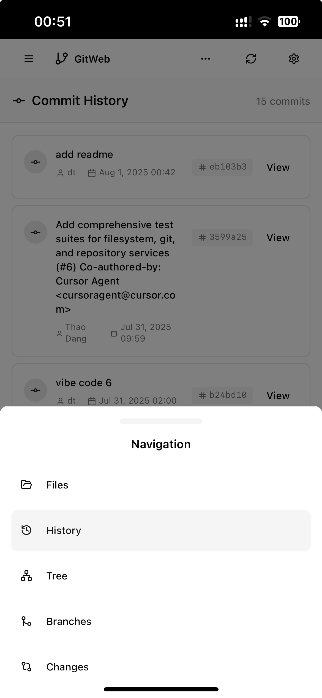

# WIP: Gitty - A Tale of a Homeserver and the Craving for a Good Git UI for remote machine

Last year, I bought a [DeskMini x600](https://www.asrock.com/nettop/AMD/DeskMini%20X600%20Series/index.asp) and set it up with [Fedora Server](https://www.fedoraproject.org/server/download/) to create a Homelab for my development work. I spend a lot of time working remotely on it from my Mac, phone, and tablet, mostly using Neovim, Zed, or Cursor. While tools like Lazygit, the integrated Git functionality in Zed, and various VS Code extensions are great, I often found myself needing a visual Git client that didn't require me to have the project open in an editor or be in a specific directory. **_I wanted something I could access from anywhere, especially on my phone, to quickly check on the progress of my coding agents or review changes without having to open a terminal._**

This is the story of why Gitty was born. It's an web-based, support vim motions, and mobile-first Git client designed for developers like me who want a simple, visual way to interact with their repositories without the fuss.

## ✨ Key Features

- **🎮 Vim Motion Support**: Navigate the entire UI using vim-style keybindings (j/k for up/down, Shift+H/L for header navigation, h/l for expand/collapse, Tab to switch contexts). Press `v` to enable! See [VIM_MOTIONS.md](VIM_MOTIONS.md) for details.
- **📱 Mobile-First Design**: Fully responsive UI optimized for phones and tablets
- **🌐 Web-Based**: Access from anywhere without installing desktop clients
- **⚡ Fast & Lightweight**: Built with modern web technologies for snappy performance

## Preview

## Development Checklist

This project is a work in progress. Here's a simplified checklist of what's done and what's next. For a more detailed breakdown, please see the [CHECKLIST.md](CHECKLIST.md) file.

-   [x] **Phase 1: Project Setup** (Backend and Frontend foundations)
-   [x] **Phase 2: Core Backend** (Repository management, Git service)
-   [x] **Phase 3: Core Frontend** (Layout, repository components, file browsing)
-   [x] **Phase 4: Git Operations** (Commit history, branch management, staging, diffing)
-   [ ] **Phase 5: Advanced Features** (Conflict resolution, UI enhancements)
-   [ ] **Phase 6: Polish & Deployment** (Testing, optimization, containerization)

## Contributing

Contributions are welcome! If you'd like to contribute, please fork the repository and create a pull request. For major changes, please open an issue first to discuss what you would like to change.

## License

This project is licensed under the MIT License - see the `LICENSE` file for details.
